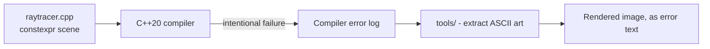

# Compile-Time Ray Tracer Architecture

## Build-time pipeline

```mermaid
flowchart LR
    Src[raytracer.cpp<br/>constexpr scene] --> Compiler[C++20 compiler]
    Compiler -->|intentional failure| Err[Compiler error log]
    Err --> Tool[tools/ - extract ASCII art]
    Tool --> Art[Rendered image, as error text]
```
